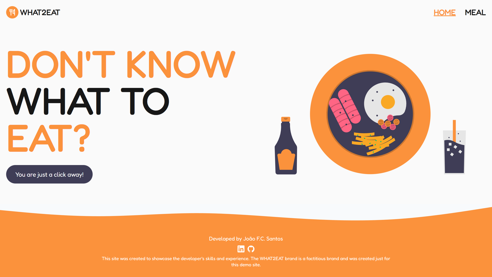

## WHAT2EAT

Don't know what to eat? This website will give you a random recipe for you.

### What frameworks and languages were used?

-   Vite
-   React
-   Typescript
-   Tailwind CSS

### API used

-   [TheMealDB](https://www.themealdb.com/)

## Veja o projeto a funcionar [aqui.]()



## Como executar

```
1. Abrir um terminal na pasta do projecto.

2. Executar o comando "yarn".

3. Executar o comando "yarn dev".

4. Abrir um navegador e ir ao localhost:5173.
```
